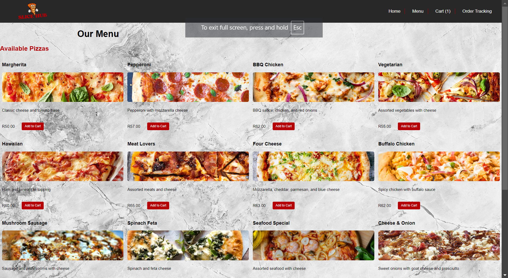
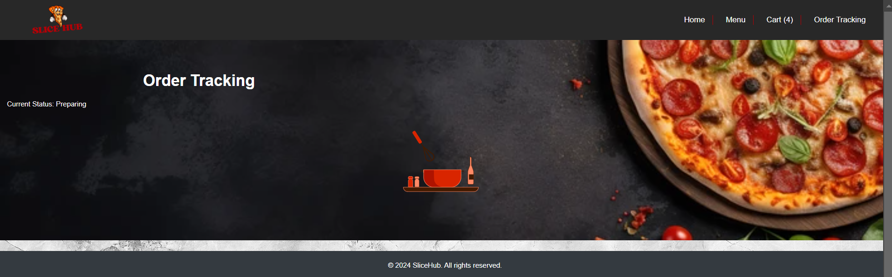

# SliceHub 🍕

**SliceHub** is a modern and responsive pizza ordering web application designed to provide users with a seamless and enjoyable experience when choosing and ordering their favorite pizzas online.

## Author

- [Tholoana Manyane](https://github.com/Tholoana96)

## Project Overview

SliceHub is a modern and responsive web application designed for pizza lovers to order their favorite pizzas online seamlessly. With a user-friendly interface, SliceHub provides an enjoyable ordering experience, allowing customers to browse a diverse menu, customize their orders, and track the status of their deliveries

## Live Demo

Check out the live version of SliceHub [https://slicehub-tholoana.netlify.app/]

## Features

- 🍕 **Responsive Design**: Adaptable layouts for both mobile and desktop devices.
- 🛒 **Order Management**: Users can add, edit, and remove items from their cart with ease.
- 🔄 **Mock API Integration**: Simulates backend services for realistic interactions.
- ✅ **Checkout Process**: Collects customer details (name, address, email) to finalize orders.
- 📦 **Order Tracking**: Real-time updates on the order status (Preparing, Baking, Out for Delivery).
- 🌟 **User-Friendly Navigation**: Intuitive navigation bar and easy access to all pages.
- 📸 **Featured Pizzas Section**: Highlights popular pizzas with images and descriptions.
- 🎉 **Promotions Section**: Displays current promotions and discounts.

## Technology Stack

- **Frontend**: HTML, CSS, JavaScript, React
- **State Management**: Context API for managing global state
- **Mock Backend**: Mock APIs to simulate order and menu management
- **Animations**: Lottie for engaging and interactive animations

## Getting Started

### Prerequisites

- Ensure you have [Node.js](https://nodejs.org/) installed on your machine.
- You should also have [npm](https://www.npmjs.com/) (Node Package Manager) installed.

### Setup Instructions

1. Clone the repository:

   ```bash
   git clone https://github.com/username/slicehub.git
   ```

2. Navigate to the project directory:

   ```bash
   cd slicehub
   ```

3. Install the required dependencies:

   ```bash
   npm install
   ```

4. Start the development server:

   ```bash
   npm start
   ```

5. Open your browser and go to http://localhost:3000 to view the application.

## Contribution

Contributions are welcome! Please feel free to submit a pull request or open an issue for any feature requests or bug reports.

## License

This project is licensed under the MIT License - see the LICENSE file for details.

## Screenshots






